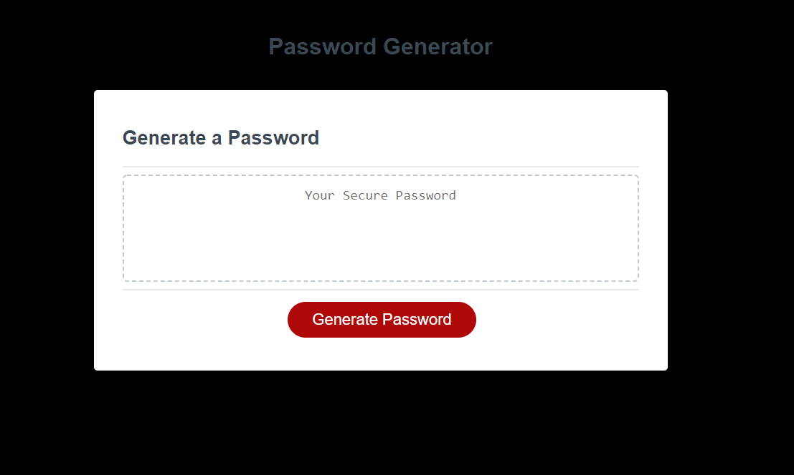

# Password-Generator

Github Deployed Link: [Password-Generator]

The purpose of this assignment was to create the javascript for a random password generator. First the user has to type in the length they want their new password to be. After the length, the user will then go through several prompts asking if they want to include any specific criteria. Criteria users can select include; numbers, lowercase letters, uppercase letters, and symbols. Once the user confirms all their criteria, a random password will be generated for them in the text box.

[My Portfolio]: https://n7-gil.github.io/Password-Generator/
